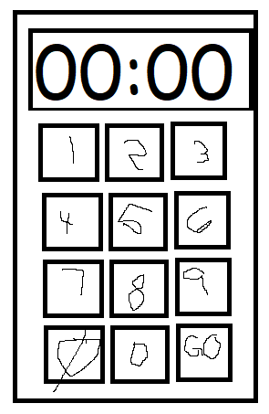
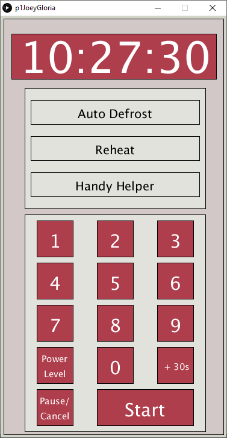

# HCI Project 1

Joey Maureen Gloria

## Issues with the design
* Too many buttons
* Some of the buttons don't make sense. What's a "hot dog" button?
* The results after selecting potato are "1POT", "2POT", or "3POT". Does this mean number of potato's in the microwave? Who needs 3 baked potatoes at once?
* The Handy Helper, Kids Meals, and Snack Bar options are unintuative. You need to press x amount of times to get the the x number on the list. For example, to get to French Fries, you need to press the Kid's Meals button 3 times.
* The beverage selection is not optimized. I would rather put hot chocolate in a keurig.

## Common Uses of a Microwave
* Reheating food for a custom amount of time
* Reheating food for a certain amount of time (+ 30 seconds)
* Popping popcorn using the instructions on the popcorn bag
* Defrosting meat

## Rare Uses of a Microwave
* Actually using the popcorn button for popcorn
* Using any of the specialized buttons (Melt Butter, Nachos, Frozen Sandwiches)
* Cooking food

## Figuring out how a microwave works
* The numpad is fairly straightforward. You can punch in a custom amount of time.
* From there, the other buttons describe preset times. For example, the *potato* button.
* After selecting a time or preset, press "START" and the time begins to count down
* This is how the user knows that the microwave has started
* After completion of the countdown, "BEEP", to show that food is finished.

## Common mistakes with current design
* Hard to figure out what the presets mean. "Hot Dogs" is too vague to know if it is safe to just press the button, so I just end up manually putting in time
* Unintuative design - all you need is a numpad, the rest of the buttons are confusing.

## Improvements
In general, I would just remove all the unneccessary presets.
All you really need is the numpad, and buttons to adjust the power level, and STOP/START.
If needed, the presets would be added in. But I personally would just like a simple microwave.

## Design
With this design, there can either be 1/2 touch screen or full touch screen.
We utilize the touch screen by taking the options and putting them behind UI interfaces.
For example, the Handy Helper button is no longer a button with a list under it.
It now shows the actual options after selecting the parent option.

Additionally, like a lot of microwaves, it would be good for acessibility if microwaves are able to weigh whats inside it to automatically measure the heat time.

I am assuming that my microwave redesign has this capability. This way, I can choose to REHEAT, then CHICKEN. It will then weigh the CHICKEN and choose a proper time.

Like most microwaves, the screen says done! And emits a noise when the time finishes.

youtube link: https://youtu.be/ojAI84uwUEM